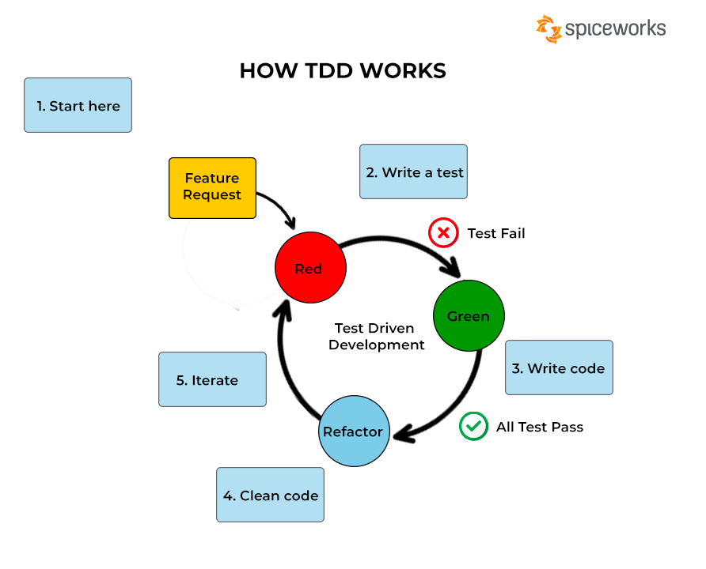

## 1. Introduction
This is a small RESTAPI application to exercising the Test Driven Development methodology.

## 2. Business Requirements
### Overview
The application is a simple blog system. It has 3 main entities: Category, Post and Tag. A Post can have many Tags and a Tag can be used in many Posts. A Post can belong to only one Category. A Category can have many Posts.

### Functional Requirements
#### Category
- Create a Category `POST /categories` (1.1)
- Update a Category `PUT /categories/{id}` (1.2)
- Delete a Category `DELETE /categories/{id}` (1.3)
- Get a Category `GET /categories/{id}`(1.3)
- Get all Categories `GET /categories` (1.4)
#### Post
- Create a Post `POST /posts` (2.1)
- Update a Post `PUT /posts/{id}` (2.2)
- Delete a Post `DELETE /posts/{id}` (2.3)
- Get a Post `GET /posts/{id}` (2.4)
- Get all Posts `GET /posts` (2.5)

#### Tag
- Create a Tag `POST /tags` (3.1)
- Update a Tag `PUT /tags/{id}` (3.2)
- Delete a Tag `DELETE /tags/{id}` (3.3)
- Get a Tag `GET /tags/{id}` (3.4)
- Get all Tags `GET /tags` (3.5)

## 3. About Test Driven Development
### What is test driven development?
Test Driven Development (TDD) is a software development process that relies on the repetition of a very short development cycle: requirements are turned into very specific test cases, then the software is improved to pass the new tests, only. This is opposed to software development that allows software to be added that is not proven to meet requirements.

### Test driven development steps 

The test driven development process is composed of 3 steps:
1. Write a test and run it. The test will fail because we haven't written any code yet.
2. Write the code and run the test. The test should pass.
3. Refactor the code and run the test. The test should still pass.
4. Repeat steps 1-3 until the feature is complete.

